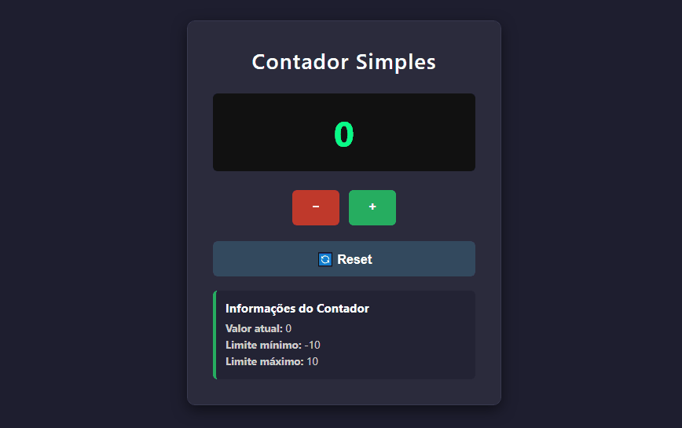

# 🔢 Contador Simples

Um contador interativo, funcional e responsivo, desenvolvido com HTML, CSS e JavaScript vanilla.

---

### 📸 Demonstração


---

### ✨ Funcionalidades

- **Design Responsivo:** A interface se adapta perfeitamente a diferentes tamanhos de tela.
- **Tema Escuro:** Uma interface moderna com cores contrastantes para uma melhor experiência visual.
- **Controle por Botões:**
    - Botões intuitivos com efeitos visuais para **incrementar**, **decrementar** e **resetar**.
- **Controle por Teclado:**
    - `↑` ou `+` para incrementar.
    - `↓` ou `-` para decrementar.
    - `R` ou `ESC` para resetar.
- **Limites:** Previne valores abaixo de -10 e acima de 10.
- **Painel:** Mostra o valor atual e os limites para o usuário.

---

### 🛠️ Tecnologias Utilizadas

- **HTML5:** Utilizado para a estrutura semântica da página.
- **CSS3:** Responsável pela estilização e animações da interface.
- **JavaScript:** Implementa a lógica de funcionamento e toda a interatividade.

---

### 🚀 Como Usar

Siga os passos abaixo para rodar o projeto localmente em sua máquina.

1.  **Clone o repositório:**
    ```bash
    git clone https://github.com/devrodrigobrito/contador-simples.git
    ```

2.  **Navegue até o diretório do projeto:**
    ```bash
    cd contador-simples
    ```

3.  **Abra o arquivo HTML:**
    Abra o arquivo `index.html` em qualquer navegador moderno (como Google Chrome, Firefox ou Microsoft Edge).

---

### 🎯 Aprendizados

Este foi meu primeiro projeto JavaScript, onde aprendi:

-   Manipulação do DOM (`document.getElementById`).
-   Uso de `Event Listeners` para interatividade.
-   Estruturas condicionais (`if/else`) para validação.
-   Aplicações de CSS Grid e Flexbox para layout.
-   Boas práticas de organização de código e documentação.

---
### 👨‍💻 Autor
- **Rodrigo Brito** - Desenvolvedor Front-End em formação
- [GitHub](https://github.com/devrodrigobrito)  


